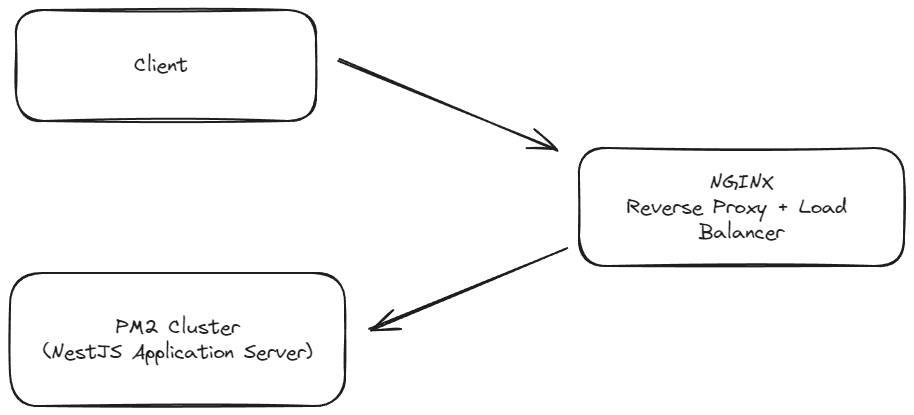

# 항해 99 백앤드 Lite 1 

## 수강생

- 박효준

## 현재 브랜치

- week2 (2주차)

### [과제] 대기업 시나리오 프로젝트로 알아보는 서버 설계

#### 선택한 시나리오

- **e-커머스 서비스** 
  - [참고 사이트](https://teamsparta.notion.site/e-1f52dc3ef5148199b230ff9ec74be86b)

#### 개발 환경 준비

- Architecture
  - Testable Business logics
  - Layered Architecture Based
  - (+) Clean / Hexagonal Architecture

- DB ORM
     - JPA / MyBatis
     - TypeORM / Prizma

- Test
     - JUnit + AssertJ
     - Jest / Mocha

#### 시나리오 선정  및 프로젝트 Milestone 작성

  문서는 README 또는 docs 디렉토리 내 .md 파일로 작성할 수 있습니다.
  README에는 상대 경로 링크만 걸어두는 방식이 추천됩니다

  시나리오 요구사항 분석 및 문서 작성 ( e.g. 시퀀스 다이어그램, ERD 등 )

  인프라 구성도를 만들고, 작성한 인프라 구성도에 있는 항목들을 간단하게 기술해주세요.
  주의할점은 다른 프로젝트 구성원이 봤을때 이해가 되어야 한다는 점을 고려해주세요.

---

### Milestone & 스프린트 

- 아키텍쳐 링크 : [README.md](./architecture/README.md)
- 마일 스톤[Projects 링크](https://github.com/users/gywns1720/projects/5)


> 링크 안들어가질 경우 
> ```text
> https://github.com/users/gywns1720/projects/5
> ```

### 구현해야할 항목

#### Description

- `e-커머스 상품 주문 서비스`를 구현해 봅니다.
- 상품 주문에 필요한 메뉴 정보들을 구성하고 조회가 가능해야 합니다.
- 사용자는 상품을 여러개 선택해 주문할 수 있고, 미리 충전한 잔액을 이용합니다.
- 상품 주문 내역을 통해 판매량이 가장 높은 상품을 추천합니다.

#### Requirements

- 아래 4가지 API 를 구현합니다.
    - 잔액 충전 / 조회 API
    - 상품 조회 API
    - 주문 / 결제 API
    - 인기 판매 상품 조회 API
- 각 기능 및 제약사항에 대해 단위 테스트를 반드시 하나 이상 작성하기
- 다수의 인스턴스로 어플리케이션 동작하더라도 기능에 문제 없도록 작성
- 동시성 이슈 고려하여 구현
- 재고 관리에 문제 없도록 구현

#### API Specs

- 잔액충전 / 조회 API (**필수**)
- 상품 조회 API (기본)
- 선착순 쿠폰 기능 (**필수**)
- 주문 / 결제 API (**필수**)
- 상위 상품 조회 API (기본)

#### 심화 과제 

- Mock API 및 Swagger API 코드 작성
- API E2E 테스트 작성

---

## 설계 

- 과제 : **_모놀리스 방식 선택_**

### 모놀리스 방식 (✅ 선택)



- Client -> Nginx -> Pm2 Cluster -> Nest Application

#### Nest JS Application 서버의 역활

- 모든 API 담당
- 하나의 Application 안의 모든 기능 구현
- 모든 기능은 `src` 폴더가 아닌 `lib` 폴더에 이용.
  - 추후 Microservice 방식으로 가든 또 다른 Application 을 만들든 공유 할 수 있도록 진행
  - 명령어 `nest g lib [package name]`

#### Socket IO

- 데이터 플랫폼 (역활 진행)
  - Socket IO 서버에 이벤트를 보내 실시간으로 알람을 전송
  - 못받는걸 대비하여 데이터베이스에 못받은 알람 내역 저장

#### Database

- MYSQL 사용 (**NestJS -> Typeorm 이용**)

ERD README : [README.md](./architecture/erd/README.md)


#### Environment

- `.env.template` 파일로 환경 설정 수정하여 진행

---

## 공부 
### MSA (❌ 서비스 복잡해질 경우 선택)

1. 규모가 커질 때
2. 릴리즈가 자주 발생할 때 
3. 트래픽이 매우 클 때
4. 전체 시스템 다운이어지는 것을 막고 싶을 때


- Client -> Nginx -> Pm2 Cluster -> Nest Microservice 

#### Nest JS API Gateway 서버의 역활

- API 라우팅 경로 설정
- 토큰 검사
- API 제한 횟수 설정
- **프론트앤드와 맨 앞 통신** 담당

#### NGINX

- Nest JS API Gateway 서버 여러대 일 경우 로드벨런스 및 Reverse Proxy 이용하여 서비스에 간접적으로 접근
- 아래 **예시**) 
```conf
upstream nest_gateway {
    server 127.0.0.1:3000;
    server 127.0.0.1:3000;
}
upstream nest_socket_io {
    server 127.0.0.1:3100;
    server 127.0.0.1:3100;
}
server {
    listen 80;

    location /api {
        proxy_pass http://nest_gateway;
        proxy_http_version 1.1;
        proxy_set_header Upgrade $http_upgrade;
        proxy_set_header Connection 'upgrade';
        proxy_set_header Host $host;
        proxy_cache_bypass $http_upgrade;
    }
    location /socket.io/ {
        proxy_pass http://nest_socket_io;
        proxy_http_version 1.1;
        proxy_set_header Upgrade $http_upgrade;
        proxy_set_header Connection 'upgrade';
        proxy_set_header Host $host;
        proxy_cache_bypass $http_upgrade;
    }
}
```

- HTTPS : NGINX 이용

#### PM2 Cluster 

- Gateway 서버 Cluster 형태로 배포
- Socket IO 서버
- 주문 서버
- 상품 서버
- 유저 서버
- 스케쥴 (단일 서버)
- 중앙 로그 서버

#### Microservice Server List

- **Optional** : 구상만 진행

##### 주문 서버

- 주문과 결제를 하는 서버입니다.
  - 주문 : 상품 정보와 사용자 정보를 받아 결제를 수행합니다.
  - 결제 : 상품에 대한 충분한 잔액이 있는지 체크 후 데이터 플랫폼에 전송 
- 데이터 플랫폼
  - Socket IO 서버에 이벤트를 보내 실시간으로 알람을 전송
  - 못받는걸 대비하여 데이터베이스에 못받은 알람 내역 저장
  - 로그 서버에 이벤트를 보내 결제 내역 전송


##### 상품 서버 

- 상품을 관리하는 서버 입니다.
- 상품 등록, 조회, 수정, 삭제 등 서비스를 이용합니다.
- 상품에 대한 재고관리 역활을 수행합니다.


##### 유저 서버

- 유저 관리하는 서버입니다.
- 권한 인증 등에 대한 서비스 도 진행합니다.
- **핵심 서비스** 역활

##### Socket IO 서버

- 프론트앤드에게 실시간으로 알람, **작업 상태확인** 역활을 진행합니다.
- 작업 상태확인 : API 호출 `요청 -> 대기 -> 완료` 패턴에서 대기중과 완료 에 대한 상태를 전송하는 역활 

##### 스케쥴 서버 (Optional) 

- Crontab 관리하는 서버 입니다.
- 스케쥴 같은거 관리하는 서버 입니다.
- 추후 하루치, 일주일치, 한달치 등 데이터를 리포트 요청을 하거나, 로그 등을 관리 요청, 상품 알람 등 스케쥴에 필요한 정보를 제공하는 서버 입니다.

##### 중앙 로그 서버 (Optional)

- 로그 분석 및 통합 모니터링이 필요할 때 사용 
- 하이브리드 방식으로 사용
  - 로그는 일관성 불필요
  - 손실 허용 
- 데이터베이스로 로그 관리

---
## 궁금증

1. MSA 장점은 각 서비스 독립성이 장점인데 핵심 서비스인 User, Auth 등 장애가 날 경우 MSA 의 장점이 문제가 발생.
