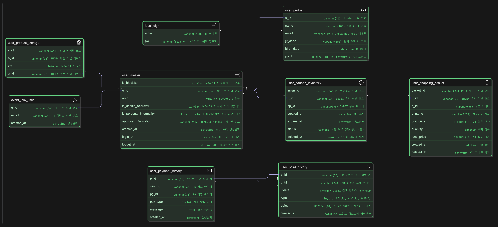
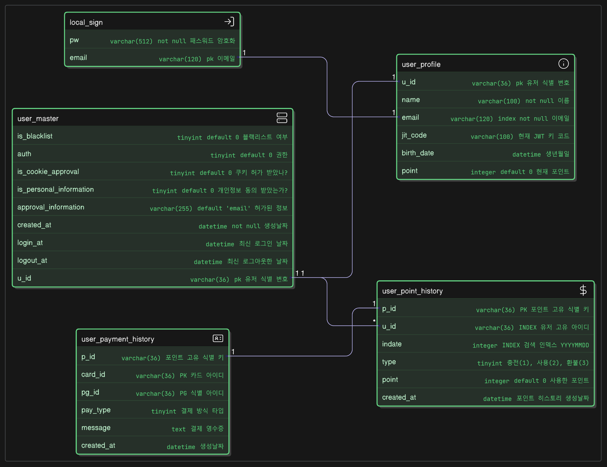

# ERD

- 최신버전 (**version 1**)
  

1. [유저 테이블](#user)
2. [상품 테이블](#product)

---
## User

---
### 테이블 목차

1. [`UserMaster` 유저 마스터 테이블](#user_master)
2. [`UserProfile` 유저 프로필 테이블](#user_profile)
3. [`LocalSign` 로컬 로그인 테이블](#local_sign)
4. [`UserCouponInventory` 유저 쿠폰 보관 테이블](#user_coupon_inventory)
5. [`UserShoppingBasket` 유저 장바구니 테이블](#user_shopping_basket)
6. [`UserProductStorage` 유저 제품 테이블](#user_product_storage)
7. [`EventJoinUser` 이벤트에 성공적으로 들어간 유저 테이블](#event_join_user)
8. [`UserPaymentHistory` 결제 내역 테이블](#user_payment_history)
9. [`UserPointHistory` 포인트 사용 내역 테이블](#user_point_history)

---

- **Version 2** [목차로 돌아가기](#user)

### user_product_storage

- s_id : 상품 보관 PK
- p_id : 상품 PK 
- cnt : 갯수
- u_id : 유저 PK

### event_join_user

- u_id : 유저 PK
- ev_id : 이벤트 식별 PK
- created_at : 생성날짜

### user_coupon_inventory

- inven_id : 인벤토리 식별 PK
- u_id : 유저 식별 PK
- cp_id : 쿠폰 PK
- created_at 쿠폰이 생성된 날짜
- expires_at 쿠폰이 만료될 날짜
- status : 쿠폰이 사용되었는지 미사용 되었는지 여부
- deleted_at : 쿠폰 만료일에서 추가로 3개월 지나면 삭제 **Crontab** 이용

### user_shopping_basket

- basket_id : 장바구니 식별 코드
- u_id 유저 식별 코드
- p_id 상품 식별 코드
- p_name 상품 이름 (캐시용)
- unit_price 상품 단가
- quantity 구매 갯수
- total_price 상품 총 금액
- created_at 장바구니 생성날짜
- deleted_at 장바구니 유효기간 지나면 제거 **Crontab** 이용

- **Version 1** [목차로 돌아가기](#user)

### local_sign

- email : 로그인할 이메일
- pw : 로그인할 비밀번호

### user_master

- u_id : 유저 PK
- is_cookie_approval : 쿠키 허가 여부
- is_personal_information : 개인정보 동의 여부
- approval_information : 동의한 정보 리스트 (콤마로 구분) 기본값 : `email`
- auth : 권한 설정  
  - 0 -> 게스트
  - 1 -> 일반등급 회원
  - 2 -> 우수등급 회원
  - 3 -> VIP 
  - 4 -> Admin 
- is_blacklist : 블랙리스트 인가?
- created_at : 계정 생성 날짜
- login_at : 최신 로그인 날짜
- logout_at : 최신 로그아웃 날짜

### user_profile

- u_id : 유저 PK
- name : 유저 이름
- email : 유저 이메일
- jit_code : JWT 토큰 검증용
- birth_date : 생년월일
- point : 현재 포인트

### user_point_history

- p_id : 포인트 PK
- u_id : 유저 PK
- indate : 검색용 INDEX 
- type : 충전인가, 사용인가, 환불인가?
- point : 사용한 포인트
- created_at : 생성된 날짜

### user_payment_history

- p_id : 포인트 PK
- u_id : 유저 PK
- pg_id : PG 사
- pay_type : 결재 방식 타입 (0 -> card)
- message : 결제 영수증 JSON 직렬화
- created_at : 생성된 날짜

---

## Product
