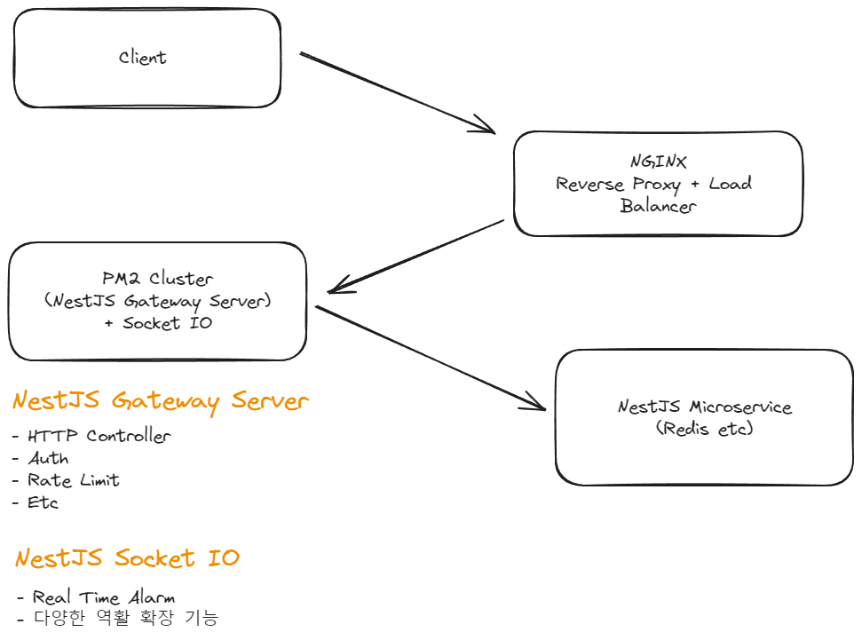

## 공부
### MSA (❌ 서비스 복잡해질 경우 선택)

1. 규모가 커질 때
2. 릴리즈가 자주 발생할 때
3. 트래픽이 매우 클 때
4. 전체 시스템 다운이어지는 것을 막고 싶을 때



- Client -> Nginx -> Pm2 Cluster -> Nest Microservice

#### Nest JS API Gateway 서버의 역활

- API 라우팅 경로 설정
- 토큰 검사
- API 제한 횟수 설정
- **프론트앤드와 맨 앞 통신** 담당

#### NGINX

- Nest JS API Gateway 서버 여러대 일 경우 로드벨런스 및 Reverse Proxy 이용하여 서비스에 간접적으로 접근
- 아래 **예시**)
```conf
upstream nest_gateway {
    server 127.0.0.1:3000;
    server 127.0.0.1:3000;
}
upstream nest_socket_io {
    server 127.0.0.1:3100;
    server 127.0.0.1:3100;
}
server {
    listen 80;

    location /api {
        proxy_pass http://nest_gateway;
        proxy_http_version 1.1;
        proxy_set_header Upgrade $http_upgrade;
        proxy_set_header Connection 'upgrade';
        proxy_set_header Host $host;
        proxy_cache_bypass $http_upgrade;
    }
    location /socket.io/ {
        proxy_pass http://nest_socket_io;
        proxy_http_version 1.1;
        proxy_set_header Upgrade $http_upgrade;
        proxy_set_header Connection 'upgrade';
        proxy_set_header Host $host;
        proxy_cache_bypass $http_upgrade;
    }
}
```

- HTTPS : NGINX 이용

#### PM2 Cluster

- Gateway 서버 Cluster 형태로 배포
- Socket IO 서버
- 주문 서버
- 상품 서버
- 유저 서버
- 스케쥴 (단일 서버)
- 중앙 로그 서버

#### Microservice Server List

- **Optional** : 구상만 진행

##### 주문 서버

- 주문과 결제를 하는 서버입니다.
    - 주문 : 상품 정보와 사용자 정보를 받아 결제를 수행합니다.
    - 결제 : 상품에 대한 충분한 잔액이 있는지 체크 후 데이터 플랫폼에 전송
- 데이터 플랫폼
    - Socket IO 서버에 이벤트를 보내 실시간으로 알람을 전송
    - 못받는걸 대비하여 데이터베이스에 못받은 알람 내역 저장
    - 로그 서버에 이벤트를 보내 결제 내역 전송


##### 상품 서버

- 상품을 관리하는 서버 입니다.
- 상품 등록, 조회, 수정, 삭제 등 서비스를 이용합니다.
- 상품에 대한 재고관리 역활을 수행합니다.


##### 유저 서버

- 유저 관리하는 서버입니다.
- 권한 인증 등에 대한 서비스 도 진행합니다.
- **핵심 서비스** 역활

##### Socket IO 서버

- 프론트앤드에게 실시간으로 알람, **작업 상태확인** 역활을 진행합니다.
- 작업 상태확인 : API 호출 `요청 -> 대기 -> 완료` 패턴에서 대기중과 완료 에 대한 상태를 전송하는 역활

##### 스케쥴 서버 (Optional)

- Crontab 관리하는 서버 입니다.
- 스케쥴 같은거 관리하는 서버 입니다.
- 추후 하루치, 일주일치, 한달치 등 데이터를 리포트 요청을 하거나, 로그 등을 관리 요청, 상품 알람 등 스케쥴에 필요한 정보를 제공하는 서버 입니다.

##### 중앙 로그 서버 (Optional)

- 로그 분석 및 통합 모니터링이 필요할 때 사용
- 하이브리드 방식으로 사용
    - 로그는 일관성 불필요
    - 손실 허용
- 데이터베이스로 로그 관리

---
## 궁금증

1. MSA 장점은 각 서비스 독립성이 장점인데 핵심 서비스인 User, Auth 등 장애가 날 경우 MSA 의 장점이 문제가 발생.
